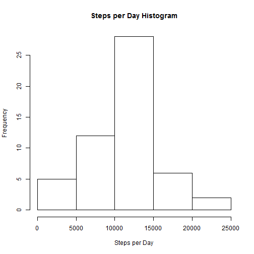
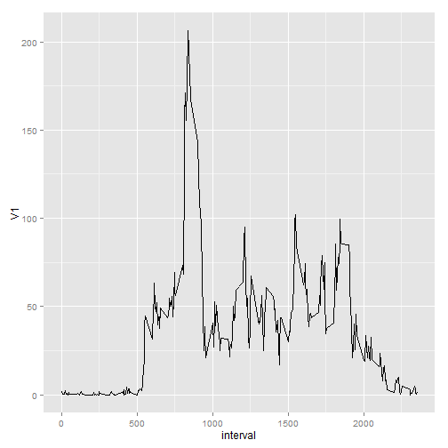
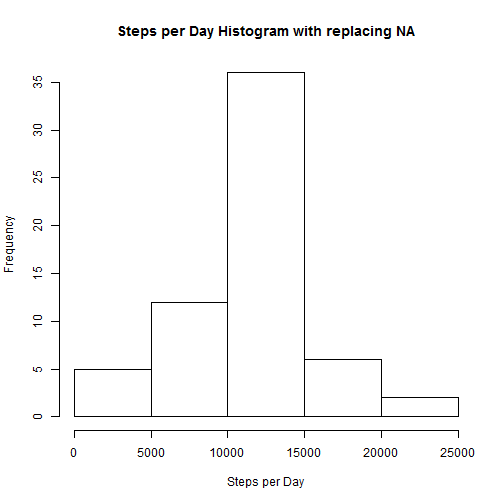

# Reproducible Research: Peer Assessment 1


## Loading and preprocessing the data

```r
# install.packages("data.table")
require(data.table)
setwd("C:/Users/Eric.Kim/Desktop/TSA Files/Coursera/Reproducible Research")
 
#Read file and subset
act<-read.csv("./activity.csv")
act$date<-as.Date(as.character(act$date, format="%Y%m%d"))
nacount<-sum(is.na(act$steps))
act<-subset(act, act$steps!= "NA")

#Aggregate by day
act<-data.table(act)
setkey(act, date)
steps<-data.frame(act[,sum(steps), by=date])
names(steps)[2]<-"stepnum"
```
## What is mean total number of steps taken per day?

```r
#Histogram
hist(steps$stepnum, main = "Steps per Day Histogram", xlab="Steps per Day")
```

 


```r
#install required packages
require(MASS)
require(UsingR)
```

```
## Loading required package: UsingR
```

```
## Warning: package 'UsingR' was built under R version 3.1.1
```

```
## Loading required package: HistData
```

```
## Warning: package 'HistData' was built under R version 3.1.1
```

```
## Loading required package: Hmisc
## Loading required package: grid
## Loading required package: lattice
## Loading required package: survival
## Loading required package: splines
## Loading required package: Formula
## 
## Attaching package: 'Hmisc'
## 
## The following objects are masked from 'package:base':
## 
##     format.pval, round.POSIXt, trunc.POSIXt, units
## 
## Loading required package: aplpack
```

```
## Warning: package 'aplpack' was built under R version 3.1.1
```

```
## Loading required package: tcltk
## Loading required package: quantreg
## Loading required package: SparseM
## 
## Attaching package: 'SparseM'
## 
## The following object is masked from 'package:base':
## 
##     backsolve
## 
## 
## Attaching package: 'quantreg'
## 
## The following object is masked from 'package:Hmisc':
## 
##     latex
## 
## The following object is masked from 'package:survival':
## 
##     untangle.specials
## 
## 
## Attaching package: 'UsingR'
## 
## The following object is masked from 'package:survival':
## 
##     cancer
## 
## The following object is masked from 'package:ggplot2':
## 
##     movies
```


```r
#mean steps per day
m<-mean(steps$stepnum)
m
```

```
## [1] 10766
```

```r
md<-median(steps$stepnum)
md
```

```
## [1] 10765
```


The mean is 1.0766 &times; 10<sup>4</sup>.  
The median is 10765.  

## What is the average daily activity pattern?

```r
#Aggregate by interval
library(ggplot2)
require(ggplot2)
act<-data.table(act)
setkey(act, interval)
intrvl<-data.frame(act[,mean(steps), by=interval])
ggplot(data=intrvl, aes(x=interval, y=V1))+geom_line()
```

 


```r
max(intrvl$V1)
```

```
## [1] 206.2
```

```r
maxInterval<-subset(intrvl$interval, intrvl$V1==max(intrvl$V1))
```

The max interval is 835

There are 2304 NA's

## Imputing missing values

```r
setwd("C:/Users/Eric.Kim/Desktop/TSA Files/Coursera/Reproducible Research")

#Read file and subset
act2<-read.csv("./activity.csv")
act2$date<-as.Date(as.character(act2$date, format="%Y%m%d"))
act2[is.na(act2)]<- mean(na.omit(act2$steps))

#Aggregate by day
act2<-data.table(act2)
setkey(act2, date)
steps2<-data.frame(act2[,sum(steps), by=date])
```


```r
#Histogram
hist(steps2$V1, main = "Steps per Day Histogram with replacing NA", xlab="Steps per Day")
```

 


```r
#calculate mean and median
m2<-mean(steps2$V1)
m2
```

```
## [1] 10766
```

```r
md2<-median(steps2$V1)
md2
```

```
## [1] 10766
```

After replacing NA with the mean steps, 
The new mean is 1.0766 &times; 10<sup>4</sup>
The new median is 1.0766 &times; 10<sup>4</sup>

## Are there differences in activity patterns between weekdays and weekends?

```r
act2$date2<-weekdays(act2$date)
act2$date3<-ifelse(act2$date2 %in% c("Monday", "Tuesday", "Wednesday", "Thursdsay", "Friday"), "Weekday", "Weekend")
```


```r
#Aggregate by interval by weekend/weekday
library(ggplot2)
require(ggplot2)
act2<-data.table(act2)
setkey(act2, interval, date3)
intrvl2<-data.frame(act2[,mean(steps), by=list(interval, date3)])
ggplot(data=intrvl2, aes(x=interval, y=V1))+geom_line()+facet_grid(.~date3)
```

 


```r
setwd("c:/Users/Eric.Kim/Documents/RepData_PeerAssessment
      +s")
```

```
## Error: cannot change working directory
```

```r
knit2html("PA1_template.Rmd")
```

```
## 
## 
## processing file: PA1_template.Rmd
```

```
## Error: duplicate label 'simpleplot'
```
